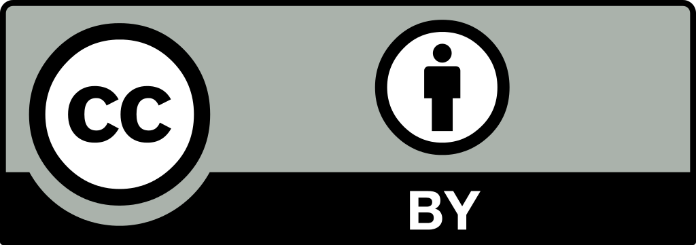

# Principles and Practices for Reproducible Science

## July 9 & 10, 2018 in HSEB 4100C

### Course Description

In this 2 day course, participants will learn, discuss, and put into practice the basic principles of reproducibility. Topics we may cover include putting data management plans into practice, developing workflows, writing documentation, finding an ontology or metadata schema, and using existing software or resources that support open science.

**Prerequisite**

Participants should have some familiarity with the research process.

**Learning Outcomes**

  * Understand challenges of reproducibility and related issues
  * Create a workflow that enables reproducible science
  * Identify the appropriate software/resource to meet research goals

### Instructor

| Contact | Tisha Mentnech, Research Librarian |
| --- | --- |
| **Mail** | Spencer S. Eccles Health Sciences Library, The University of Utah, 10 N 1900 E, SLC, UT 84112 |
| **Email** | [tisha.mentnech@utah.edu](mailto:tisha.mentnech@utah.edu) |
## Schedule

### Monday, July 9

| Time | Topic |
| --- | --- |
| 09:00AM - 09:30AM | Course overview & [Pre-class survey](https://goo.gl/forms/p2Q84JQNXJmKnn4P2) |
| 09:30AM - 11:00AM | Module 1: [How Did We Get Here & Where Are We Going](./1-TheBigPicture.ipynb) |
| 11:00AM - 11:15AM | Breaking |
| 11:15AM - 12:30PM | Module 2: [File Management](./2-FileManagement.ipynb) |
| 12:30PM - 01:30PM | Lunch |
| 01:30PM - 03:30PM | Module 3: [Data Management](./3-DataManagement.ipynb)|
| 03:30PM - 03:45PM | Break |
| 03:45PM - 04:15PM | Wrap Up |

| Allot 3 hours | Post-class work |

### Tuesday, July 10

| Time | Topic |
| --- | --- |
| 09:00AM - 09:15AM | Reflection |
| 09:15AM - 11:25AM | Module 4, [ResearchTool Kit](./4_1-BuildYourToolkit.ipynb) |
| 11:25PM - 11:30AM | Break |
| 11:30AM - 12:30PM | Module 4, Continued [Research Toolkit](./4_2-BuildYourToolkit.ipynb) |
| 12:30PM - 01:30PM | Lunch |
| 01:30PM - 2:00PM | Module 5: [Research Dissemination](./5-ResearchDissemination.ipynb) |
| 02:00PM - 02:15PM | Break |
| 02:15PM - 03:45PM | Module 6: [Final Synthesis](./6-Synthesis.ipynb) |
| 03:45PM - 04:15PM | Wrap Up & [Post-class Survey](https://goo.gl/forms/DjtKrA2hacJvooCC3)

---
## Acknowledgements

I would like to thank Brian Chapman for the opportunity to teach this course; Daureen Nesdill for sharing her training materials on data management; Vicky Steeves for sharing resources on containers; and the Eccles Library staff for their moral support. Special thanks to Mellanye Lackey for their general support of this endeavor. And most importantly, thanks to Shirley Zhao who taught this course last summer and provided an amazing and detailed framework to continue this course.

Thanks to the participants for being present, motivated, and engaged in their own learning experience -- you made the course so enjoyable to teach.

